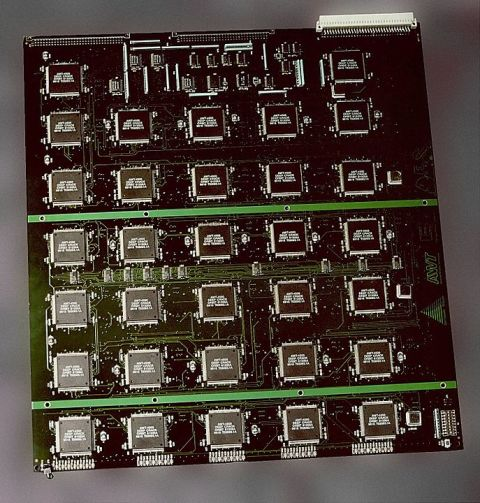

# Brute-force password cracking



*Figure 1: [DES cracker board](https://en.wikipedia.org/wiki/EFF_DES_cracker) developed in 1998 by the Electronic Frontier Foundation (EFF);
this device can be used to brute-force a DES key. The original uploader was Matt Crypto at English Wikipedia.
Later versions were uploaded by Ed g2s at en.wikipedia - CC BY 3.0 us,
[https://commons.wikimedia.org/w/index.php?curid=2437815](https://commons.wikimedia.org/w/index.php?curid=2437815).*

The program [omp-brute-force.c](base/omp-brute-force.c) contains an encrypted
message stored in the array `enc[]` of length 64. The message has been encrypted using the *XOR* algorithm,
which applies the "exclusive or" (xor) operator between the plaintext and the encryption key.
The XOR algorithm is not secure, unless the key is truly random and has the same length of the plaintext;
however, it is "good enough" for this exercise.

*XOR* is a *symmetric* encryption algorithm, meaning that the same key is used for encryption and decryption.
The function `xorcrypt(in, out, n, key, keylen)` encrypts or decrypts a message with a given key.
To encrypt, `in` points to the plaintext and `out` to a memory buffer where the ciphertext will be stored.
To decrypt, in points to the ciphertext and out to a memory buffer where the plaintext will be stored.

The parameters are as follows:

- `in` points to the source message. This buffer does not need to be zero-terminated since it may contain an encrypted message.
- `out` points to a memory buffer of at least *n Bytes* (the same length of the source message), that must be allocated by the
  caller. At the end, this buffer contains the source message that has been encrypted/decrypted with the encryption key.
- `n` is the length, in Bytes, of the source message.
- `key` points to the encryption/decryption key. The key is a sequence of arbitrary bytes, and therefore does not need to be
  zero-terminated.
- `keylen` is the length of the encryption/decryption key.

The *XOR* algorithm will happily decrypt any message with any key; if the key is not correct, the decrypted message will not make
any sense.

For this exercise we know that the plaintext is a zero-terminated ASCII string that begins with 0123456789.
We also know that the encryption key is a sequence of 8 ASCII numeric characters; therefore, the key is a string from "00000000"
and "99999999". The goal is to write a program to brute-force the key using OpenMP.
The program should try every key until a valid message is found, i.e., a message that begins with 0123456789.
At the end, the program must print the plaintext, which is a famous quote from [an old film](https://en.wikipedia.org/wiki/WarGames).

The main loop can not be parallelized with the omp for construct (why?).
Therefore, we use omp parallel and manually partition the key space among threads.
Remember that `omp parallel` can be applied to a structured block, i.e., a block with a single entry and a single exit point.
Therefore, the thread who finds the correct key can not exit the block using `return`, `break` or `goto`
(the compiler should give a compile-time error).
However, we need to terminate the program at most shortly after the correct key is found. How?

Compile with:

```shell
gcc -std=c99 -Wall -Wpedantic -Werror -fopenmp omp-brute-force.c -o omp-brute-force
```

Run with:

```shell
OMP_NUM_THREADS=2 ./omp-brute-force
```

> **Note.** the execution time of the parallel program might change irregularly depending on $P$. Why?

## Files

- [omp-brute-force.c](base/omp-brute-force.c)

You can use wget to transfer the files from the Web page to the server:

```shell
wget https://www.moreno.marzolla.name/teaching/HPC/handouts/omp-brute-force.c
```
