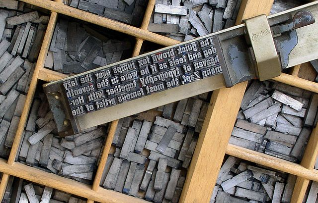

# Character counts



*By Willi Heidelbach, CC BY 2.5,
[https://commons.wikimedia.org/w/index.php?curid=1181525](https://commons.wikimedia.org/w/index.php?curid=1181525).*

The file [omp-letters.c](https://www.moreno.marzolla.name/teaching/HPC/handouts/omp-letters.c) contains a serial program that
computes the number of occurrences of the letters ‘a’…‘z’ in an ASCII file read from standard input.
No distinction is made between upper and lowercase characters; non-letter characters are ignored.
We provide some text documents to experiment with, courtesy of the [Project Gutenberg](https://www.gutenberg.org/).
You should observe that the character frequencies are about the same across the documents, despite the fact that they have been
written by different authors. Indeed, the relative frequencies of characters are language-dependent but author-independent.
You are encouraged to experiment with books in other languages, also available on
[Project Gutenberg Web site](https://www.gutenberg.org/).

The goal of this exercise is to modify the function `make_hist(text, hist)` to use of OpenMP parallelism. The function takes as
parameter a pointer text to a zero-terminated string representing the document, and an uninitialized array `hist[26]`.
At the end, `hist[0]` must contain the occurrences of the letter $a$ in text, `hist[1]` the occurrences of the letter $b$, up to
`hist[25]` that represents the occurrences of the letter $z$.

A reasonable approach is to partition the text among the OpenMP threads, so that each thread computes the frequencies of a block
of text; the final result is the vector sum of all local histograms.

Start by partitioning the text manually as described below, i.e., without using the `omp for` directive; this helps you to better
understand how partitioning is done, but in practice `omp for` is easier to use and results in more readable code.

Since the text is a character array of length TEXT_LEN, thread $p$ computes the extremes of its chunk as:

```C
const int from = (TEXT_LEN * p) / num_threads;
const int to = (TEXT_LEN * (p + 1)) / num_threads;
```

where `num_threads` is the size of OpenMP team. Thread $p$ will compute the frequencies of the characters in
`text[from .. (to-1)]`.

You need to create a shared, two-dimensional array `local_hist[num_threads][26]` initialized to zero.
Thread $p$ operates on `local_hist[p][]` so that no race conditions are possible.
If thread sees character $x$, $x \in \{\texttt{'a'}, \ldots, \texttt{'z'}\}$, it will increase the value `local_hist[p][x - 'a']`.
When all threads are done, the master computes the result as the column-wise sum of `local_hist`.
In other words, the number of occurrences of the character `('a' + c)` is:

$$ \texttt{hist}[c] = \sum_{p = 0}^{\texttt{num\_threads} - 1} \texttt{local\_hist}[p][c] $$

Also, don’t forget that there is a reduction on `nlet` that reports the number of letters; this might be done using the
`reduction()` clause of the `omp for` directive.

A simpler solution involves the use of the `omp parallel for` directive with array reduction that is available since OpenMP 4.5.
To perform the sum-reduction on each element of `hist[ALPHA_SIZE]` use the following syntax:

```C
#pragma omp parallel for ... reduction(+:hist[:ALPHA_SIZE])
```

(ALPHA_SIZE is a symbol defined at the beginning of the program, with value 26; you can use the literal 26 as well).
This works like a scalar reductions, with the differences that the compiler actually computes ALPHA_SIZE sum-reductions on
`hist[0], … hist[ALPHA_SIZE - 1]`.

Compile with:

```shell
gcc -std=c99 -Wall -Wpedantic -Werror -fopenmp omp-letters.c -o omp-letters
```

Run with:

```shell
./omp-letters < the-war-of-the-worlds.txt
```

## Files

- [omp-letters.c](https://www.moreno.marzolla.name/teaching/HPC/handouts/omp-letters.c)
- Some sample texts (see [Project Gutenberg](https://www.gutenberg.org/) for more).
    - [War and Peace](https://www.moreno.marzolla.name/teaching/HPC/handouts/war-and-peace.txt) by L. Tolstoy
    - [The Hound of the Baskervilles](https://www.moreno.marzolla.name/teaching/HPC/handouts/the-hound-of-the-baskervilles.txt)
      by A. C. Doyle
    - [The War of the Worlds](https://www.moreno.marzolla.name/teaching/HPC/handouts/the-war-of-the-worlds.txt) by H. G. Wells
