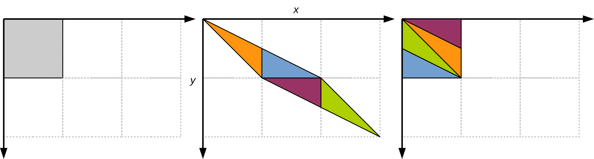
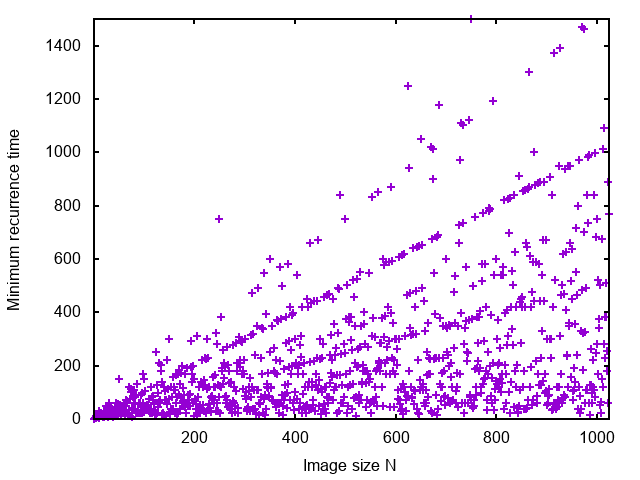

# Arnold’s cat map


[Arnold's cat map](https://en.wikipedia.org/wiki/Arnold%27s_cat_map) is a continuous chaotic function that has been studied in the
'60s by the Russian mathematician [Vladimir Igorevich Arnold](https://en.wikipedia.org/wiki/Vladimir_Arnold).
In its discrete version, the function can be understood as a transformation of a bitmapped image $P$ of size $N x N$ into a new
image $P'$ of the same size. For each $0 \leq x, y < N$, the pixel of coordinates $(x,y)$ in $P$ is mapped into a new position
$C(x, y) = (x', y')$ in $P'$ such that:

$$x' = (2x + y) \bmod N, \qquad y' = (x + y) \bmod N$$

(“mod” is the integer remainder operator, i.e., operator % of the C language). We may assume that $(0, 0)$ is top left and
$(N-1, N-1)$ is bottom right, so that the bitmap can be encoded as a regular two-dimensional C matrix.

The transformation corresponds to a linear “stretching” of the image, that is then broken down into triangles that are rearranged
as shown in Figure 1.



Arnold’s cat map has interesting properties. Let $C^k(x, y)$ be the $k$-th iterate of $C$, i.e.:

$$
C^k(x, y) =
\begin{cases}
(x, y) & \text{if } k = 0\\
C(C^{k - 1}(x,y)) & \text{if } k > 0
\end{cases}
$$

Therefore, $C^2(x,y) = C(C(x,y))$, $C^3(x,y) = C(C(C(x,y)))$, and so on.

If we apply $C$ once, we get a severely distorted version of the input.
If we apply $C$ again on the result, we get an even more distorted image.
As we keep applying $C$, the original image is no longer discernible.
However, after a certain number of iterations, that depends on the image size $N$ and has been proved to never exceed $3N$,
we get back the original image! (Figure 2).


The *minimum recurrence time* is the minimum number of iterations $k \geq 1$ such that produce the original image, i.e.,
$C^k(x, y) = (x, y)$ for all $(x, y)$.
For example, the minimum recurrence time for [cat1368.pgm](input/cat1368.pgm)
of size 1368x1368 is 36.

The minimum recurrence time depends on the image size $N$ only.
No closed formula is known to compute the minimum recurrence time given $N$, although there are results and bounds that apply to
specific cases.

You are given a serial program that computes the $k$-th iterate of Arnold’s cat map on a square image.
The program reads the image from standard input in [PGM](https://en.wikipedia.org/wiki/Netpbm) (*Portable GrayMap*) format.
The results is printed to standard output in PGM format. For example:

```shell
./omp-cat-map 100 < cat1368.pgm > cat1368-100.pgm
```

applies the cat map $k=100$ times on *cat1368.phm* and saves the result to *cat1368-100.pgm*.

To display a PGM image you might need to convert it to a different format, e.g., JPEG.
Under Linux you can use convert from the ImageMagick package:

```shell
convert cat1368-100.pgm cat1368-100.jpeg
```

Modify the function `cat_map()` to make use of shared-memory parallelism using OpenMP.
You might want to take advantage from the fact that Arnold’s cat map is *invertible*, meaning that any two different points
$(x_1, y_1)$ and $(x_2, y_2)$ are always mapped to different points $(x'_1, y'_1) = C(x_1, y_1)$ and $(x'_2, y'_2) = C(x_2, y_2)$.
Therefore, the output image $P'$ can be filled up in parallel without race conditions.

To compile:

```shell
gcc -std=c99 -Wall -Wpedantic -Werror -fopenmp omp-cat-map.c -o omp-cat-map
```

To execute:

```shell
./omp-cat-map k < input_file > output_file
```

Example:

```shell
./omp-cat-map 100 < cat1368.pgm > cat1368-100.pgm
```

## Suggestions

The provided function `cat_map()` is based on the following template:

```C
for (int i = 0; i < k; i++) {
    for (int y = 0; y < N; y++) {
        for (int x = 0; x < N; x++) {
            (x', y') = C(x, y);
            P'(x', y') = P(x, y);
        }
    }
    P = P';
}
```

The two inner loops build $P'$ from $P$; the outer loop applies this transformation $k$ times, using the result of the previous
iteration as the source image.
Therefore, the outer loop can *not* be parallelized (the result of an iteration is used as input for the next one).
Therefore, in the version above you can either:
1. Parallelize the y loop only, or
2. Parallelize the x loop only, or
3. Parallelize both the y and x loops using the collapse(2) clause.

(I suggest to try options 1 and/or 3. Option 2 does not appear to be efficient in practice: why?).

We can apply the *loop interchange* transformation to rewrite the code above as follows:

```C
for (int y = 0; y < N; y++) {
    for (int x = 0; x < N; x++) {
        xcur = x;
        ycur = y;
        for (int i = 0; i < k; i++) {
            (xnext, ynext) = C(xcur, ycur);
            xcur = xnext;
            ycur = ynext;
        }
        P'(xnext, ynext) = P(x, y);
    }
}
```

This version can be understood as follows: the two outer loops iterate over all pixels $(x, y)$.
For each pixel, the inner loop computes the target position $(\mathit{xnext}, \mathit{ynext}) = C^k(x,y)$ that the pixel of
coordinates $(x, y)$ will occupy after $k$ iterations of the cat map.

In this second version, we have the following options:
- Parallelize the outermost loop on y, or
- Parallelize the middle loop on x, or
- Parallelize the two outermost loops with the collapse(2) directive.

(I suggest to try option c).

Intuitively, we might expect that (c) performs better than (3), because:
- the loop granularity is higher, and
- there are fewer writes to memory.

Interestingly, this does not appear to be the case (at least, not on every processor).
Table 1 shows the execution time of two versions of the `cat_map()` function
(“No loop interchange” refers to option (3); “Loop interchange” refers to option (c)).
The program has been compiled with:

```shell
gcc -std=c99 -Wall -Wpedantic -Werror -O0 -fopenmp omp-cat-map.c -o omp-cat-map
```

(-O0 prevents the compiler from applying code transformations that might alter the functions too much) and executed as:

```shell
./omp-cat-map 2048 < cat1368.pgm > /dev/null
```

Each measurement is the average of five independent executions.

| Processor           | Cores | GHz | GCC version | No loop interchange | Loop interchange |
| ------------------- | ----- | --- | ----------- | ------------------- | ---------------- |
| Intel Xeon E3-1220  |     4 | 3.5 |      11.4.0 |                6.84 |            12.90 |
| Intel Xeon E5-2603  |    12 | 1.7 |       9.4.0 |                6.11 |             7.74 |
| Intel i7-4790       | 4 + 4 | 3.6 |       9.4.0 |                6.25 |             6.02 |
| Intel i7-9800X      | 8 + 8 | 3.8 |      11.4.0 |                2.27 |             2.34 |
| Intel i5-11320H     | 8 + 8 | 4.5 |       9.4.0 |                3.94 |             4.01 |
| Intel Atom N570     | 8 + 8 | 1.6 |       7.5.0 |              128.69 |            92.47 |
| Raspberry Pi 4      |     4 | 1.5 |       8.3.0 |               35.72 |            32.55 |

*Execution time (in seconds; lower is better) of the command `./omp-cat-map 2048 < cat1368.pgm > /dev/null` using all processor
cores, with different implementations of the cat map iteration.*

On some platforms (Intel i5, i7 and Raspberry Pi 4) there is little or no difference between the two versions.
Loop interchange provides a significant performance boost on the very old Intel Atom N570 processor,
but provides worse performance on the Xeon processors.

## To probe further

What is the minimum recurrence time of image [cat1024.pgm](input/cat1024.pgm)
of size 1024x1024? We can answer this question without the need for an input image.
To understand how, let us suppose that one particular pixel, say $(x_1, y_1)$, has minimum recurrence time 15.
This means that after 15 iterations, the pixel at coordinates $(x_1, y_1)$ will return to its starting position.
Suppose that another pixel of coordinates $(x_2, y_2)$ has minimum recurrence time 21.
How many iterations of the cat map are required to have *both* pixels back to their original positions?

The answer is 105, which is the least common multiple (LCM) of 15 and 21.
From this observation we can devise the following algorithm.
Let $k(x,y)$ be the minimum recurrence times of the pixels of coordinates $0 \leq x, y < N$, $0 \leq x, y < N$.
Then, the minimum recurrence time of the whole image is the least common multiple of all $k(x, y)$.
Table 2 shows the minimum recurrence time for some $N$.

| N    | Minimum recurrence time |
| ---- | ----------------------- |
|   64 |                      48 |
|  128 |                      96 |
|  256 |                     192 |
|  512 |                     384 |
| 1368 |                      36 |

*Minimum recurrence time for some image sizes $N$*

Figure 3 shows the minimum recurrence time as a function of $N$.
Despite the fact that the values jumps around, they tend to align along straight lines.



[omp-cat-map-rectime.c](base/omp-cat-map-rectime.c) contains an incomplete
skeleton of a program that computes the minimum recurrence time of a $N \times N$ image.
Complete the serial program, and then implement a parallel version using OpenMP.

## Files

- [omp-cat-map.c](base/omp-cat-map.c)
  [hpc.h](../../include/hpc.h)
- [omp-cat-map-rectime.c](base/omp-cat-map-rectime.c)
- [cat1024.pgm](input/cat1024.pgm)
  (what is the minimum recurrence time of this image?)
- [cat1368.pgm](input/cat1368.pgm)
  (verify that the minimum recurrence time of this image is 36)
