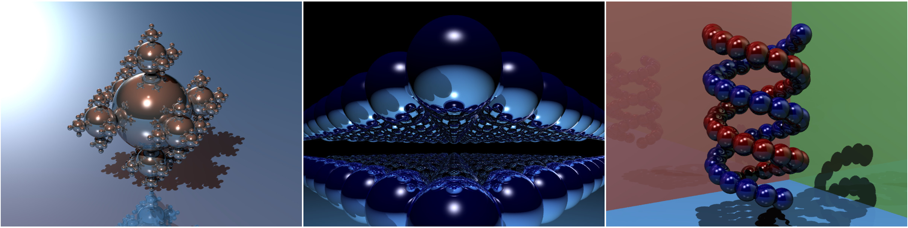
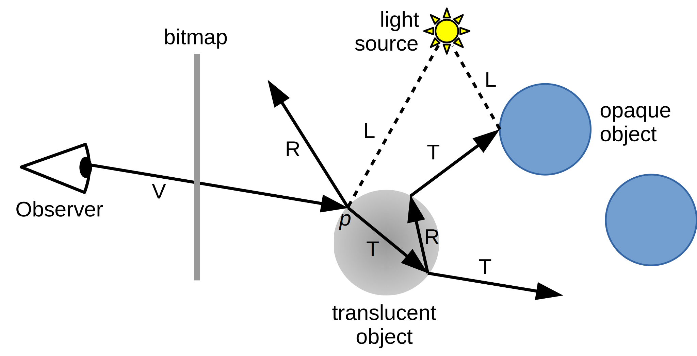

# Ray tracing

The file [omp-c-ray.c](base/omp-c-ray.c) contains the implementation of a
[simple ray tracer](https://github.com/jtsiomb/c-ray) written by [John Tsiombikas](http://nuclear.mutantstargoat.com/) and
released under the GPLv2+ license. Figure 1 shows a few images that can be produced by this program.



*Some images produced by the ray tracer; the input files are, from left to right:
[sphfract.small.in](input/sphfract.small.in),
[spheres.in](input/spheres.in),
[dna.in](input/dna.in)*

The table below shows the approximate rendering time of each image on the lab machine (Xeon E5-2603 v4 1.70GHz), using a single
core.

| File                                         | Time (s)      |
| -------------------------------------------- | ------------- |
| [sphfract.big.in](input/sphfract.big.in)     |         895.5 |
| [sphfract.small.in](input/sphfract.small.in) |          36.5 |
| [spheres.in](input/spheres.in)               |          27.9 |
| [dna.in](input/dna.in)                       |          17.8 |

*Render time with default parameters (resolution , no oversampling), lab machine using a single core, gcc 9.4.0.*

The goal of this exercise is to parallelize the `render()` function using OpenMP. The serial program is well structured: functions
don’t modify global variables, so there are not hidden dependencies. If you have time, measure the *speedup* and the
*strong scaling efficiency* of the parallel version.

Although not strictly necessary, it is useful to understand [how a ray tracer](https://en.wikipedia.org/wiki/Ray_tracing_(graphics))
works using Whitted’s recursive algorithm (T. Whitted, *An improved illumination model for shaded display*, Commun. ACM 23, 6,
June 1980, 343–349. [https://doi.org/10.1145/358876.358882](https://doi.org/10.1145/358876.358882)).
Refer to figure below.



*Figure 2: Recursive ray tracer*

The scene is represented by a list of spheres. The program generates a primary ray (V) from the observer towards each pixel.
For each ray, the program determines the ray-sphere intersection point p that is closest to the observer, and one or more
secondary rays are cast, depending on the material of the object p belongs to:

- A *light ray* (L) towards each light source, to see whether p is directly illuminated.
- If the surface is reflective, a *reflected ray* (R) and repeat the procedure recursively.
- If the surface is translucent, a *transmitted ray* (T) and the procedure is repeated recursively
  (`omp-c-ray` does not support translucent objects, so this step never happens).

The time required to compute the color of a pixel depends on the number of spheres and lights in the scene, and on the material
of the spheres; reflective/translucent surfaces generate additional rays that must be handled.
This suggests that the time required to compute a pixel color is highly variable, leading to load imbalance.

To compile:

```shell
gcc -std=c99 -Wall -Wpedantic -Werror -fopenmp omp-c-ray.c -o omp-c-ray -lm
```

To render a scene, e.g., [sphfract.small.in](input/sphfract.small.in):

```shell
./omp-c-ray -s 800x600 < sphfract.small.in > img.ppm
```

The command above produces an image img.ppm with a resolution 800x600. To convert the image to a more common format such as JPEG:

```shell
convert img.ppm img.jpeg
```

`omp-c-ray` accepts a number of optional command-line parameters; to see the complete list:

```shell
./omp-c-ray -h
```

## Files

- [omp-c-ray.c](base/omp-c-ray.c)
- [sphfract.small.in](input/sphfract.small.in) and [sphfract.big.in](input/sphfract.big.in)
  (generated by [gensphfract.c](base/gensphfract.c))
- [spheres.in](input/spheres.in) (generated by [genspheres.c](base/genspheres.c))
- [dna.in](input/dna.in) (generated by [gendna.c](base/gendna.c))
