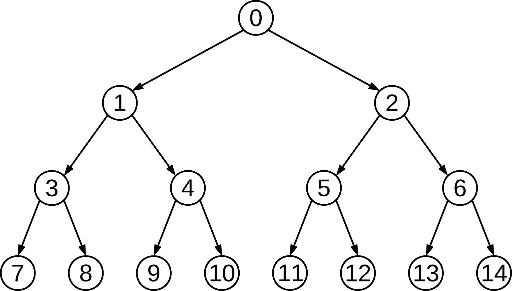

# Broadcast using point-to-point communications

The purpose of this exercise is to implement the function

```C
void my_Bcast(int *v)
```

using point-to-point communications.
The function sends the value `*v` that resides on the local memory of process 0 to all other processes.
In practice, this function should be equivalent to calling

```C
MPI_Bcast(v,             /* buffer   */
          1,             /* count    */
          MPI_INT,       /* datatype */
          0,             /* root     */
          MPI_COMM_WORLD /* comm     */
          );
```

> **Note.** `MPI_Bcast()` must always be preferred to any home-made solution.
> The purpose of this exercise is to learn how `MPI_Bcast()` **might** be implemented.

To implement `my_Bcast()`, each process determines its own rank $p$ and the number $P$ of MPI processes.
Then, process 0:

- sends *v to processes $(2p + 1)$ and $(2p + 2)$, provided that they exist.

Any other process $p > 0$:

- receives an integer from $(p - 1) / 2$ and stores it in `*v`;
- sends `*v` to processes $(2p + 1)$ and $(2p + 2)$, provided that they exist.

For example, with $P = 15$ you get the communication pattern shown in *Figure 1*;
arrows indicate point-to-point communications, numbers indicate the rank of processes.
The procedure above should work correctly for any $P$.



*Figure 1: Broadcast tree with $P = 15$ processes*

The file [mpi-my-bcast.c](base/mpi-my-bcast.c) contains the skeleton of the `my_Bcast()` function.
Complete the implementation using point-to-point send/receive operations.

To compile:

```shell
mpicc -std=c99 -Wall -Wpedantic -Werror mpi-my-bcast.c -o mpi-my-bcast
```

To execute:

```shell
mpirun -n 4 ./mpi-my-bcast
```

## Files

- [mpi-my-bcast.c](base/mpi-my-bcast.c)
