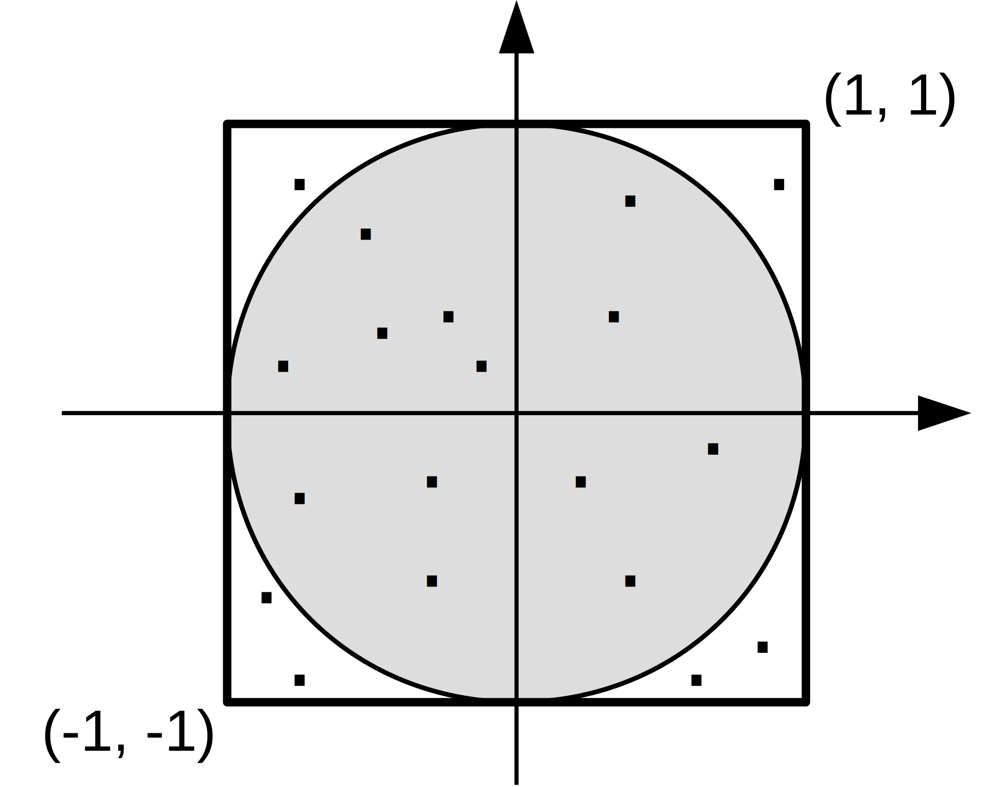

# Monte Carlo approximation of $\pi$

The file [mpi-pi.c](base/mpi-pi.c) contains a serial program for computing the approximate value of $\pi$ using a Monte Carlo
algorithm.
Monte Carlo algorithms use pseudorandom numbers to compute an approximation of some quantity of interest.



*Figure 1: Monte Carlo computation of the value of $\pi$*

The idea is simple (see *Figure 1*).
We generate $N$ random points uniformly distributed over a square with corners $(-1, -1)$ at and $(1, 1)$, and count the number
$I$ of points falling inside the circle with center $(0, 0)$ and unitary radius.
Then, we have:

$$ \frac{\text{N. of points inside the circle}}{\text{Total n. of points}}
   \approx \frac{\text{Area of circle}}{\text{Area of enclosing square}} $$

from which, substituting the appropriate variables:

$$ \frac{x}{N} \approx \frac{\pi}{4} $$

hence $\pi \approx 4x / N$. This estimate becomes more accurate as the number of points $N$ increases.

Modify the serial program to parallelize the computation.
Several parallelization strategies are possible, but for now you are advised to implement the following one ($P$ is the number of
MPI processes):

1. Each process gets the value of the number of points $N$ from the command line. You may initially assume that $N$ is a multiple
   of $P$, and then relax this requirement to make the program with any value of $N$.
2. Each process $p$, including the master, generates $N / P$ random points and keeps track of the number $I_p$ of points that
   fall inside the circle;
3. The master computes the total number $I$ of points that fall inside the circle as the sum of $I_p$, $p = 0, \ldots, P - 1$.

Step 3 involves a reduction operation. Start by implementing the inefficient solution, e.g., each process $p > 0$ sends its local
value $I_p$ to the master using point-to-point send/receive operations.
The master receives $I_p$ from all each process $p = 1, \ldots, P - 1$ (the master already knows $I_0$), computes their sum and
the prints the approximate value of $\pi$ as $(4I / N)$.

Once you have a working implementation, modify it to use the preferred solution, i.e., `MPI_Reduce()` instead of point-to-point
communications.

To compile:

```shell
mpicc -std=c99 -Wall -Wpedantic -Werror mpi-pi.c -o mpi-pi -lm
```

To execute:

```shell
mpirun -n P ./mpi-pi [N]
```

Example, using 4 MPI processes:

```shell
mpirun -n 4 ./mpi-pi 1000000
```

## Files

- [mpi-pi.c](base/mpi-pi.c)
