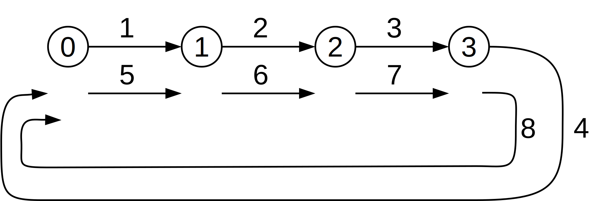

# Ring communication

Write a MPI program [mpi-ring.c](base/mpi-ring.c) that implements a message
exchange along a ring.
Let $P$ be the number of MPI processes; the program should behave according to the following specification:

- The program receives an integer $K \geq 1$ from the command line. $K$ is the number of “turns” of the ring.
  Since all MPI processes have access to the command line parameters, they know the value $K$ without the need to communicate.
- Process 0 (the master) sends process 1 an integer, whose initial value is 1.
- Every process $p$ (including the master) receives a value $v$ from the predecessor $p - 1$, and sends $(v + 1)$ to the successor
  $p + 1$. The predecessor of $0$ is $(p - 1)$, and the successor of $(p - 1)$ is $0$.
- The master prints the value received after the $K$-th iteration and the program terminates. Given the number of processes and
  the value of $K$, what value should be printed by the master?

For example, if $K = 2$ and there are $P = 4$ processes, the communication should be as shown in *Figure 1* (arrows are messages
whose content is the number reported above them).
There are $K = 2$ turns of the ring; at the end, process $0$ receives and prints 8.



*Figure 1: Ring communication*

To compile:

```shell
mpicc -std=c99 -Wall -Wpedantic -Werror mpi-ring.c -o mpi-ring
```

To execute:

```shell
mpirun -n 4 ./mpi-ring
```

## Files

- [mpi-ring.c](base/mpi-ring.c)
