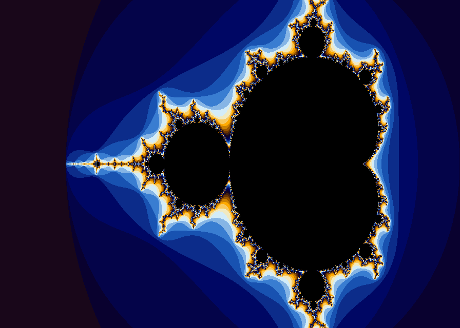
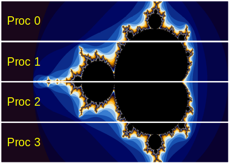

# Mandelbrot set



The file [mpi-mandelbrot.c](base/mpi-mandelbrot.c) contains a MPI program that computes the Mandelbrot set; it is not a parallel
program, because the master process does everything.

The program accepts the image height as an optional command-line parameter; the width is computed automatically to include the
whole set. Process 0 writes the output image to the file `mandebrot.ppm` in PPM (_Portable Pixmap_) format.
To convert the image, e.g., to PNG you can use the following command on the Linux server:

```shell
convert mandelbrot.ppm mandelbrot.png
```

Write a parallel version where all MPI processes contribute to the computation.
To do this, we can partition the image into $P$ vertical blocks where $P$ is the number of MPI processes, and let each process
draws a portion of the image (see *Figure 1*).



*Figure 2: Domain decomposition for the computation of the Mandelbrot set with 4 MPI processes*

Specifically, each process computes a portion of the image of size $\mathit{xsize} \times (\mathit{ysize} / P)$ (see below how to
handle the case where _ysize_ is not an integer multiple of $P$).
This is an _embarrassingly parallel_ computation, since there is no need to communicate.
At the end, the processes send their local result to the master using the `MPI_Gather()` function, so that the master can assemble
the image.
We use three bytes to encode the color of each pixel, so the `MPI_Gather()` operation will transfer blocks of $(3 \times
\mathit{xsize} \times \mathit{ysize} / P)$ elements of type `MPI_BYTE`.

You can initially assume that _ysize_ is an integer multiple of $P$, and then relax this assumption, e.g., by letting process 0
take care of the last `(ysize % P)` rows.
Alternatively, you can use blocks of different sizes and use `MPI_Gatherv()` to combine them.

You might want to keep the serial program as a reference. To check the
correctness of the parallel implementation, compare the output images
produced by the serial and parallel versions with the command:

```shell
cmp file1 file2
```

They must be identical, i.e., the `cmp` program should print no message.

To compile:

```shell
mpicc -std=c99 -Wall -Wpedantic -Werror mpi-mandelbrot.c -o mpi-mandelbrot
```

To execute:

```shell
mpirun -n NPROC ./mpi-mandelbrot [ysize]
```

Example:

```shell
mpirun -n 4 ./mpi-mandelbrot 800
```

## Files

- [mpi-mandelbrot.c](base/mpi-mandelbrot.c)
