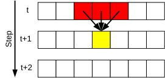
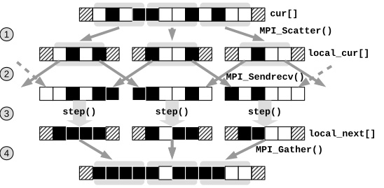

# Rule 30 Cellular Automaton

Cellular Automata (CAs) are examples of *stencil computations*. In this exercise we implement the
[Rule 30 Cellular Automaton](https://en.wikipedia.org/wiki/Rule_30).

The Rule 30 CA is a 1D cellular automaton that consists of an array $x[N]$ of $N$ integers that can be either $0$ or $1$.
The state of the CA evolves at discrete time steps: the new state of a cell depends on its current state,
and on the current state of the left and right neighbors.
We assume cyclic boundary conditions, so that the neighbors of $x[0]$ are $x[N-1]$ and $x[1]$, and the neighbors of $x[N-1]$ are
$x[N-2]$ and $x[0]$ (*Figure 1*).



*Figure 1: Rule 30 CA*

Given the current values $pqr$ of three adjacent cells, the new value $q'$ of the cell in the middle is computed according to
Table 1.

*Table 1: Rule 30 (■ = 1, □ = 0):*

| Title                              |     |     |     |     |     |     |     |     |
|------------------------------------|:---:|:---:|:---:|:---:|:---:|:---:|:---:|:---:|
| Current configuration $pqr$        | ■■■ | ■■□ | ■□■ | ■□□ | □■■ | □■□ | □□■ | □□□ |
| New state $q'$ of the central cell | □   | □   | □   | ■   | ■   | ■   | ■   | □   |

The sequence □□□■■■■□ = 00011110 on the second row is the binary representation of decimal 30, from which the name ("Rule 30 CA").

The file [mpi-rule30.c](base/mpi-rule30.c) contains a serial program that computes the evolution of the Rule 30 CA, from an
initial condition where only the central cell is 1.
The program accepts two optional command line parameters: the domain size $N$ and the number of steps `n_steps`.
At the end, rank 0 saves an image rule30.pbm of size $N \times \textit{n\_steps}$ like the one shown in *Figure 2*.
Each row represents the state of the automaton at a specific time step (1 = black, 0 = white).
Time moves from top to bottom: the first line is the initial state (time 0), the second line is the state at time 1, and so on.


*Figure 2: Evolution of Rule 30 CA*

The pattern shown in *Figure 2* is similar to the pattern on the [Conus textile](https://en.wikipedia.org/wiki/Conus_textile)
shell, a highly poisonous marine mollusk that can be found in tropical seas (*Figure 3*).


*Figure 3: Conus Textile by Richard Ling - Own work; Location: Cod Hole, Great Barrier Reef, Australia, CC BY-SA 3.0,
[https://commons.wikimedia.org/w/index.php?curid=293495](https://commons.wikimedia.org/w/index.php?curid=293495)*

The goal of this exercise is to parallelize the serial program using MPI, so that the computation of each step is distributed
across MPI processes. The program should operate as follows (see Figure 4 and also [this document](base/mpi-rule30.pdf)):



*Figure 4: Parallelization of the Rule 30 CA*

1. The domain is distributed across the $P$ MPI processes using `MPI_Scatter()`; we assume that $N$ is an integer multiple of $P$.
   Each partition is augmented with two ghost cells, that are required to compute the next states.
2. Each process sends the values on the border of its partition to the left and right neighbors using `MPI_Sendrecv()`.
   This operation must be performed twice, to fill the left and right ghost cells (see below).
3. Each process computes the next state for the cells in its partition.
4. Since we want to dump the state after each step, the master collects all updated partitions using `MPI_Gather()`, and stores
   the result in the output file.

At the end of step 4 we go back to step 2: since each process already has its own (updated) partition, there is no need to perform
a new `MPI_Scatter()`.

Let `comm_sz` be the number of MPI processes. Each partition has $\mathit{local\_width} = N / \mathit{comm\_sz} + 2$ elements
(including two ghosts cell). We denote with `cur[]` the full domain stored on process $0$, and with `local_cur[]` the augmented
domains assigned to each process (i.e., containing ghost cells).

Assuming that `cur[]` is also extended with two ghost cells, as in the program provided (this is not required in the MPI version),
the distribution of `cur[]` can be accomplished with the instruction:

```C
MPI_Scatter(&cur[LEFT],             /* sendbuf    */
            N / comm_sz,            /* sendcount  */
            MPI_CHAR,               /* sendtype   */
            &local_cur[LOCAL_LEFT], /* recvbuf    */
            N / comm_sz,            /* recvcount  */
            MPI_CHAR,               /* recvtype   */
            0,                      /* root       */
            MPI_COMM_WORLD          /* comm       */
            );
```

(the symbols LEFT and LOCAL_LEFT are defined in the source code to improve readability).


*Figure 5: Using `MPI_Sendrecv()` to exchange ghost cells*

Filling the ghost cells is a bit tricky and requires two calls to `MPI_Sendrecv()` (see *Figure 5*).
First, each process sends the value of the *rightmost* domain cell to the successor, and receives the value of the left ghost cell
from the predecessor.
Then, each process sends the contents of the *leftmost* cell to the predecessr, and receives the value of the right ghost cell
from the successor. All processes execute the same communication: therefore, each one should call `MPI_Sendrecv()` twice.

To compile:

```shell
mpicc -std=c99 -Wall -Wpedantic -Werror mpi-rule30.c -o mpi-rule30
```

To execute:

```shell
mpirun -n P ./mpi-rule30 [width [steps]]
```

Example:

```shell
mpirun -n 4 ./mpi-rule30 1024 1024
```

The output is stored to a file rule30.pbm.

## Files

- [mpi-rule30.c](base/mpi-rule30.c)
- [Additional information](base/mpi-rule30.pdf)
