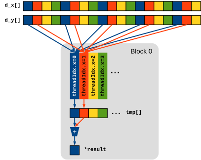

# Dot product

## Familiarize with the environment

The server has three identical GPUs (NVidia GeForce GTX 1070).
The first one is used by default, although it is possible to select another GPU either programmatically (`cudaSetDevice(0)` uses
the first GPU, `cudaSetDevice(1)` uses the second one, and so on), or using the environment variable `CUDA_VISIBLE_DEVICES`.

For example:

```shell
CUDA_VISIBLE_DEVICES=0 ./cuda-stencil1d
```

runs `cuda-stencil1d` on the first GPU (default), while:

```shell
CUDA_VISIBLE_DEVICES=1 ./cuda-stencil1d
```

runs the program on the second GPU.

Run `deviceQuery` from the command line to display the hardware features of the GPUs.

## Scalar product

The program [cuda-dot.cu](base/cuda-dot.cu) computes the dot product of two arrays `x[]` and `y[]` of length $n$.
Modify the program to use the GPU, by defining a suitable kernel and modifying the `dot()` function to use it.
The dot product $s$ of two arrays `x[]` and `y[]` is defined as:

$$
s = \sum_{i = 0}^{n - 1} x[i] \times y[i]
$$

In this exercise we implement a simple (although not efficient) approach where we use a _single_ block of _BLKDIM_ threads.
The algorithm works as follows:

1. The GPU executes a single 1D thread block containing _BLKDIM_ threads; use the maximum number of threads per block supported by
   the hardware, which is _BLKDIM = 1024_

2. The block defines a float array `tmp[]` of length _BLKDIM_ in shared memory

3. Thread $t$ ($t = 0, \ldots, \mathit{BLKDIM}-1$) computes $(x[t] \times y[t] + x[t + \mathit{BLKDIM}] \times y[t +
   \mathit{BLKDIM}] + x[t + 2 \times \mathit{BLKDIM}] \times y[t + 2 \times \mathit{BLKDIM}] + \ldots)$ and stores the result in
   `tmp[t]` (see *Figure 1*).

4. When all threads have completed the previous step (hint: use `__syncthreads()`), thread 0 performs the sum-reduction of `tmp[]`
   and computes the final result that can be transferred back to the host.



Your program must work correctly for any value of $n$, even if it is not a multiple of _BLKDIM_.

A better way to compute a reduction will be shown in future lectures.

To compile:

```shell
nvcc cuda-dot.cu -o cuda-dot -lm
```

To execute:

```shell
./cuda-dot [len]
```

Example:

```shell
./cuda-dot
```

## Files

- [cuda-dot.cu](base/cuda-dot.cu)
- [hpc.h](../../include/hpc.h)
