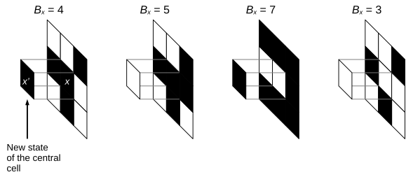
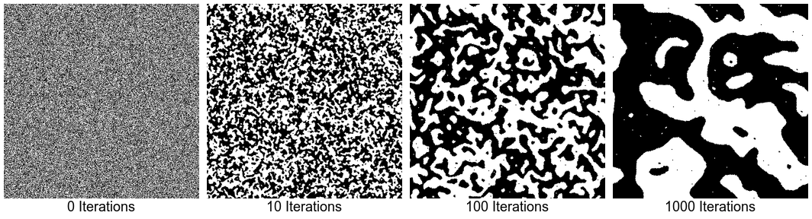
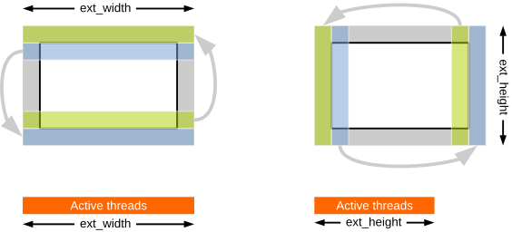
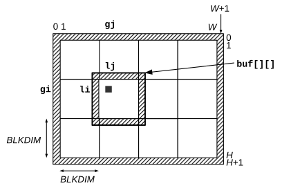
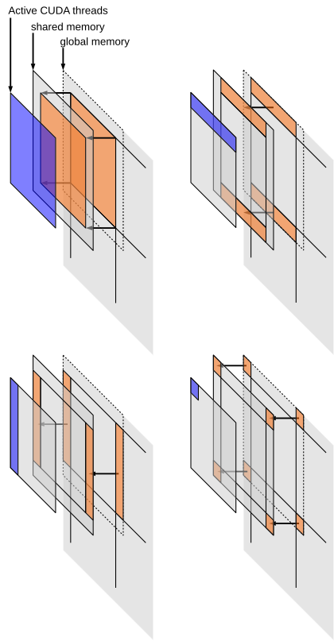

# ANNEAL Cellular Automaton

The ANNEAL Callular Automaton (also known as _twisted majority rule_) is a simple two-dimensional, binary CA defined on a grid of
size $W \times H$.
Cyclic boundary conditions are assumed, so that each cell has eight neighbors.
Two cells are adjacent if they share a side or a corner.

The automaton evolves at discrete time steps $0, 1, \ldots$.
The new state $x'$ at time $t + 1$ of a cell $x$ depends on its current state at time $t$ and on the current state of its
neighbors.
Specifically, let $B_x$ be the number of cells in state 1 within the neighborhood of size $3 \times 3$ centered on $x$
(including $x$ itself).
Then, if $B_x = 4$ or $B_x \geq 6$ the new state $x'$ is 1, otherwise it is 0:

$$
x' = \begin{cases}
1 & \text{if $B_x = 4$ or $B_x \geq 6$} \\
0 & \text{otherwise}
\end{cases}
$$

See *Figure 1* for some examples.



To simulate synchronous, concurrent updates of all cells, two domains must be used.
The state of a cell is read from the "current" domain, and new values are written to the "next" domain.
"Current" and "next" are exchanged at the end of each step.

The initial states are chosen at random with uniform probability.
*Figure 2* shows the evolution of a grid of size $256 \times 256$ after 10, 100 and 1024 steps.
We observe the emergence of "blobs" that grow over time, with the exception of small "specks".



I made a short YouTube video to show the evolution of the automaton over time:

[](https://www.youtube-nocookie.com/embed/TSHWSjICCxs)

The program [cuda-anneal.cu](base/cuda-anneal.cu) computes the evolution of the _ANNEAL_ CA after $K$ iterations.
The final state is written to a file.
The goal of this exercise is to modify the program to use the GPU to update the domain.

Some suggestions:

- Start writing a version that does _not_ use shared memory.
  Transform `copy_top_bottom()`, `copy_left_right()` and `step()` into kernels.
  The size of the thread blocks that copy the sides of the domain will be different from the size of the domain that computes
  the evolution of the automaton (see below).

- Use a 1D array of threads to copy the ghost cells.
  `copy_top_bottom()` requires $(W + 2)$ threads, and `copy_left_right()` requires $(H + 2)$ threads (*Figure 3*).

- To compute new states, create at least $W \times H$ threads organized in 2D blocks of size $32 \times 32$.

- In the `step()` kernel, each thread computes the new state of a cell $(i, j)$.
  We are working with an extended domain with ghost rows/columns, hence the "true" (non-ghost) cells are those with
  coordinates $1 \leq i \leq H$, $1 \leq j \leq W$.
  Therefore, each thread will compute $i, j$ as:
```C
  const int i = 1 + threadIdx.y + blockIdx.y * blockDim.y;
  const int j = 1 + threadIdx.x + blockIdx.x * blockDim.x;
```
  Before making any computation, each thread must verify that $1 \leq i \leq H$, $1 \leq j \leq W$, so that excess threads are
  deactivated.



## Using local memory

This program _might_ benefit from the use of shared memory, since each cell is read 9 times by 9 different threads in the same
block.
However, you might observe no improvement on modern GPUs, since they have on-board caches.
In fact, you might actually observe that using shared memory _decreases_ the performance of the computation, since there is not
enough data reuse to compensate for the overhead of managing the shared memory.
Despite this, it is a useful exercise to use local memory anyway, to see how it can be done.

Let us assume that thead blocks have size $\mathit{BLKDIM} \times \mathit{BLKDIM}$, where _BLKDIM = 32_ divides $W$ and $H$.
Each block uses a local buffer `buf[BLKDIM+2][BLKDIM+2]` which includes a ghost area.
The buffer is filled with data from the current domain, and the new cell states are computed using the data from the buffer.

Each thread is mapped to cell $(gi, gj)$ in the global domain, and to a copy of the same cell at coordinates $(li, lj)$ in the
local buffer.
The coordinates can be computes as follows:

```C
const int gi = 1 + threadIdx.y + blockIdx.y * blockDim.y;
const int gj = 1 + threadIdx.x + blockIdx.x * blockDim.x;
const int li = 1 + threadIdx.y;
const int lj = 1 + threadIdx.x;
```



There are several ways to fill the ghost area, all of them rather cumbersome and potentially inefficient.
The solution proposed below is one of them; other possibilities exist.

We use blocks of size $\mathit{BLKDIM} \times \mathit{BLKDIM}$.
Filling the central part of the local domain (i.e., everything excluding the ghost area) is done with a single instruction
executed by all threads:

```C
buf[li][lj] = *IDX(cur, ext_width, gi, gj);
```

where `ext_width = (W + 2)` is the width of the domain including the ghost area.



Filling the ghost area can be done as follows (see *Figure 5*):

1. The upper and lower rows are delegated to the threads of the first row (i.e., those with $li = 1$);
2. The left and right columns are delegated to the threads of the first column (i.e., those with $lj = 1$);
3. The corners are delegated to the top left thread with $(li, lj) = (1, 1)$.

You might be tempted to collapse steps 1 and 2 into a single step that is carried out, e.g., by the threads of the first row.
This could work, but it would be difficult to generalize the program to domains whose sides $W, H$ are not multiple of _BLKDIM_.

In practice, you may use the following schema:

```C
if (li == 1) {
    "fill buf[0][lj] and buf[BLKDIM + 1][lj]"
}
if (lj == 1) {
    "fill buf[li][0] and buf[li][BLKDIM + 1]"
}
if (li == 1 && lj == 1) {
    "fill buf[0][0]"
    "fill buf[0][BLKDIM + 1]"
    "fill buf[BLKDIM + 1][0]"
    "fill buf[BLKDIM + 1][BLKDIM + 1]"
}
```

Handling the ghost area is more difficult if $W, H$ are not multiple of _BLKDIM_.
Deactivating threads outside the domain is not enough: you need to modify the code that fills the ghost area.

To compile without using shared memory:

```shell
nvcc cuda-anneal.cu -o cuda-anneal
```

To generate an image after every step:

```shell
nvcc -DDUMPALL cuda-anneal.cu -o cuda-anneal
```

You can make an AVI / MPEG-4 animation using:

```shell
ffmpeg -y -i "cuda-anneal-%06d.pbm" -vcodec mpeg4 cuda-anneal.avi
```

To compile with shared memory:

```shell
nvcc --ptxas-options=-v -DUSE_SHARED cuda-anneal.cu -o cuda-anneal-shared
```

To execute:

```shell
./cuda-anneal [steps [W [H]]]
```

Example:

```shell
./cuda-anneal 64
```

## References

- Tommaso Toffoli, Norman Margolus, _Cellular Automata Machines: a new environment for modeling_, MIT Press, 1987,
  ISBN 9780262526319. [PDF](https://people.csail.mit.edu/nhm/cam-book.pdf) from Norman Margolus home page.

## Files

- [cuda-anneal.cu](base/cuda-anneal.cu)
- [hpc.h](../../include/hpc.h)
