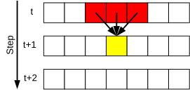
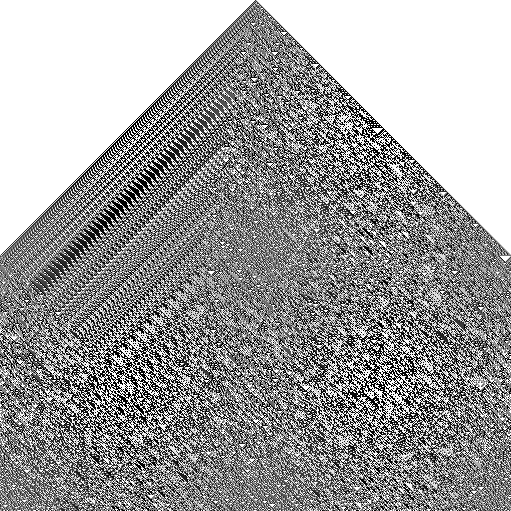
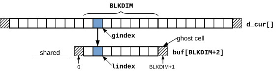

# Rule 30 cellular automaton

The goal of this exercise is to implement the [Rule 30 Cellular Automaton](https://en.wikipedia.org/wiki/Rule_30) in CUDA.

The Rule 30 CA is a 1D cellular automaton that consists of an array $x[N]$ of $N$ integers that can be either $0$ or $1$.
The state of the CA evolves at discrete time steps: the new state of a cell depends on its current state,
and on the current state of the left and right neighbors.
We assume cyclic boundary conditions, so that the neighbors of $x[0]$ are $x[N-1]$ and $x[1]$, and the neighbors of $x[N-1]$ are
$x[N-2]$ and $x[0]$ (*Figure 1*).



*Figure 1: Rule 30 CA*

Given the current values $pqr$ of three adjacent cells, the new value $q'$ of the cell in the middle is computed according to
Table 1.

*Table 1: Rule 30 (■ = 1, □ = 0):*

| Title                              |     |     |     |     |     |     |     |     |
|------------------------------------|:---:|:---:|:---:|:---:|:---:|:---:|:---:|:---:|
| Current configuration $pqr$        | ■■■ | ■■□ | ■□■ | ■□□ | □■■ | □■□ | □□■ | □□□ |
| New state $q'$ of the central cell | □   | □   | □   | ■   | ■   | ■   | ■   | □   |

The sequence □□□■■■■□ = 00011110 on the second row is the binary representation of decimal 30, from which the name ("Rule 30 CA");
more details can be found [here](base/mpi-rule30.pdf).

The file [cuda-rule30.cu](base/cuda-rule30.cu) contains a serial program that computes the evolution of the Rule 30 CA,
assuming an initial condition where only the cell in the middle of the domain is 1.
The program accepts two optional command line parameters: the domain size $N$ and the number of steps _nsteps_.
At the end, the program writes to disk the image `rule30.pbm` of size $N \times \textit{nsteps}$ shown in *Figure 2*.



*Figure 2: Evolution of Rule 30 CA*

Each row represents the state of the automaton at a specific time step (1 = black, 0 = white).
Time moves from top to bottom: the first line is the initial state (time 0), the second line is the state at time 1, and so on.

Interestingly, the pattern shown in *Figure 2* is similar to the pattern on the
[Conus textile](https://en.wikipedia.org/wiki/Conus_textile) shell, a highly poisonous marine mollusk that can be found in
tropical seas (*Figure 3*).


*Figure 3: Conus Textile by Richard Ling - Own work; Location: Cod Hole, Great Barrier Reef, Australia, CC BY-SA 3.0,
[https://commons.wikimedia.org/w/index.php?curid=293495](https://commons.wikimedia.org/w/index.php?curid=293495)*

The goal of this exercise is to write a parallel version where the computation of the new states are performed by CUDA threads.
In particular, the `rule30()` function should be turned into a kernel.
Assume that the domain size $N$ is a multiple of the number of threads per block (_BLKDIM_).

I suggest that you start with a version that does not use shared memory; this first version should be easily derived from the
provided serial code.

Since each domain cell is read three times by three different threads within the same block, the computation _might_ benefit from
the use of shared memory.

> **Note:** The use shared memory could make the program _slower_ on modern GPUs.
> The reason is that there is little data reuse, and modern GPUs are equipped with caches that work reasonably well in these
> situations.
> However, it is useful to practice with shared memory, so this exercise should be considered as it is: an exercise.

To use shared memory, refer to the simple example of 1D stencil computation that we have seen during the class; in this case, the
radius of the stencil is one, i.e., the new state of each cell depends on the state of a cell and the state of the two neighbors.
Be careful, since in this exercise we are assuming a cyclic domain, whereas in the stencil computation discussed in the class we
did not.



*Figure 3: Using shared memory*

Looking at *Figure 2*, you might proceed as follows:

- `d_cur[]` is the current state on GPU memory.

- We create a kernel, say `fill_ghost(...)` that fills the ghost area of `d_cur[]`.
  The kernel will be executed by a single thread only, since just two values need to be copied, and therefore will be executed as
  `fill_ghost<<<1, 1>>>(...)`

- We create another kernel that computes the new state of the domain, given the current state.
  To this aim, we use 1D blocks and grid.
  Each block defined a `__shared__` array `buf[BLKDIM + 2]`; we need `BLKDIM + 2` elements since we need to include ghost cells in
  each partition in order to be able to compute the new states of all cells.

- Each thread computes the "local" index `lindex` in the `buf[]` array, and a "global" index `gindex` in the `d_cur[]` array, of
  the element it is associated with.
  Care should be taken, since both the local and global domains have ghost cells.
  Therefore, indices should be computed as:
```C
const int lindex = 1 + threadIdx.x;
const int gindex = 1 + threadIdx.x + blockIdx.x * blockDim.x;
```

- Each thread copies one element from global to shared memory:
```C
buf[lindex] = cur[gindex];
```

- The first thread of each block also fills the ghost area of the shared array `buf[]`:
```C
if (threadIdx.x == 0) {
    buf[0] = cur[gindex - 1];
    buf[BLKDIM + 1] = cur[gindex + BLKDIM];
}
```

To generate the output image, the new domain should be transferred back to host memory after each iteration.
Then, `d_cur` and `d_next` must be exchanged before starting the next iteration.

To compile:

```shell
nvcc cuda-rule30.cu -o cuda-rule30
```

To execute:

```shell
./cuda-rule30 [width [steps]]
```

Example:

```shell
./cuda-rule30 1024 1024
```

The output is stored to the file `cuda-rule30.pbm`.

## Files

- [cuda-rule30.cu](base/cuda-rule30.cu)
- [hpc.h](../../include/hpc.h)