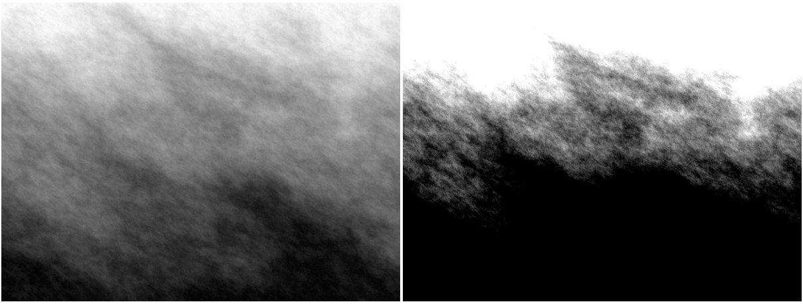
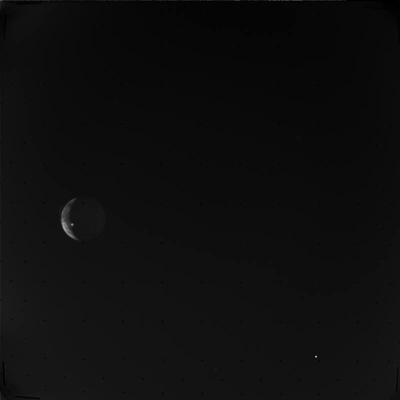

# Map gray levels

Let us consider a grayscale bitmap with $M$ rows and $N$ columns, where the color of each pixel is an integer from 0 (black) to
255 (white).
Given two values _low_, _high_, $0 \leq \mathit{low} < \mathit{high} \leq 255$, the function `map_levels(img, low, high)`
modifies `img` so that the pixels whose gray level is less than _low_ become black, those whose gray level is greater than _high_
become white, and those whose gray level is between _low_ and _high_ (inclusive) are linearly mapped to the range $[0, 255]$.

Specifically, if $p$ is the gray level of a pixel, the new level $p'$ is defined as:

$$
p' = \begin{cases}
0 & \text{if}\ p < \mathit{low}\\
\displaystyle\frac{255 \times (p - \mathit{low})}{\mathit{high} - \mathit{low}} & \text{if}\ \mathit{low} \leq p \leq \mathit{high}\\
255 & \text{is}\ p > \mathit{high}
\end{cases}
$$

*Figure 1* shows the image produced by the command

```shell
./simd-map-levels 100 180 < simd-map-levels-in.pgm > out.pgm
```



*Figure 1: Left: original image [simd-map-levels-in.pgm](img/simd-map-levels-in.pgm); Right: after level mapping with
`./simd-map-levels 100 180 < simd-map-levels-in.pgm > out.pgm`*

We provide the image [C1648109](img/C1648109.pgm) taken by the [Voyager 1](https://voyager.jpl.nasa.gov/) probe on March 8, 1979.
The image shows Io, one of the four [Galilean moons of the planet Jupiter](https://en.wikipedia.org/wiki/Galilean_moons).
The Flight Engineer [Linda Morabito](https://en.wikipedia.org/wiki/Linda_A._Morabito) was using this image to look for background
stars that could be used to determine the precise location of the probe.
To this aim, she remapped the levels so that the faint stars would be visible.
This lead to one of the most important discoveries of modern planetary sciences: see by yourself by running the program:

```shell
./simd-map-levels 10 30 < C1648109.pgm > out.pgm
```

and look at what appears next to the disc of Io at ten o'clock...



*Figure 2: Image C1648109 taken by Voyager 1 ([source](https://opus.pds-rings.seti.org/#/mission=Voyager&target=Io&cols=opusid,instrument,planet,target,time1,observationduration&widgets=mission,planet,target&order=time1,opusid&view=detail&browse=gallery&cart_browse=gallery&startobs=481&cart_startobs=1&detail=vg-iss-1-j-c1648109))*

The file [simd-map-levels.c](base/simd-map-levels.c) contains a serial implementation of function `map_levels()` above.
The goal of this exercise is to develop a SIMD version using GCC _vector datatypes_.
We start by defining a vector datatype `v4i` that represents four integers:

```C
typedef int v4i __attribute__((vector_size(16)));
#define VLEN (sizeof(v4i) / sizeof(int))
```

The idea is to process the image four pixels at a time. However, the serial code:

```C
int *pixel = bmap + i * width + j;
if (*pixel < low) {
    *pixel = BLACK;
} else if (*pixel > high) {
    *pixel = WHITE;
} else {
    *pixel = (255 * (*pixel - low)) / (high - low);
}
```

is problematic because it contains conditional statements that can not be directly vectorized.
To address this issue we use the _selection and masking_ technique.
Let `pixels` be a pointer to a `v4i` SIMD array.
Then, the expression `mask_black = (*pixels < low)` produces a SIMD array of integers whose elements are -1 for those pixels whose
gray level is less than _low_, 0 otherwise.
`mask_black` can therefore be used as a bit mask to assign the correct values to these pixels.

Using the idea above, we can rewrite the code as follows:

```C
v4i *pixels = (v4i *) (bmap + i * width + j);
const v4i mask_black = (*pixels < low);
const v4i mask_white = (*pixels > high);
const v4i mask_map = ??? ;
*pixels = ((mask_black & BLACK) |
           (mask_white & WHITE) |
           (???));
```

The compiler automatically promotes `BLACK` and `WHITE` to SIMD vectors whose elements are all `BLACK` or `WHITE`, respectively.
The code above can be further simplified since `(mask_black & BLACK)` always produces a SIMD array whose elements are all zeros:
why?.

The SIMD version requires that:

1. Each row of the bitmap is stored at a memory address that is multiple of 16
2. The image width is multiple of 4, the `v4i` SIMD vector width

The program guarantees both conditions by adding columns so that the width is multiple of 4.
The attribute `width` of structure `PGM_image` is the width of the _padded_ image, while `true_width` is the true width of the
_actual_ image, $\texttt{width} \geq \texttt{true\_width}$.

To compile:

```shell
gcc -std=c99 -Wall -Wpedantic -O2 -march=native simd-map-levels.c -o simd-map-levels
```

To execute:

```shell
./simd-map-levels low high < input_file > output_file
```

where $0 \leq \mathit{low} < \mathit{high} \leq 255$.

Example:

```shell
./simd-map-levels 10 30 < C1648109.pgm > C1648109-map.pgm
```

## Files

- [simd-map-levels.c](base/simd-map-levels.c)
- [hpc.h](../../include/hpc.h)
- Some input images: [simd-map-levels-in.pgm](img/simd-map-levels-in.pgm), [C1648109.pgm](img/C1648109.pgm)

You can generate input images of arbitrary size with the command:

```shell
convert -size 1024x768 plasma: -depth 8 test-image.pgm
```
