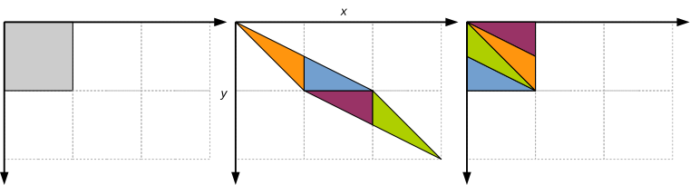
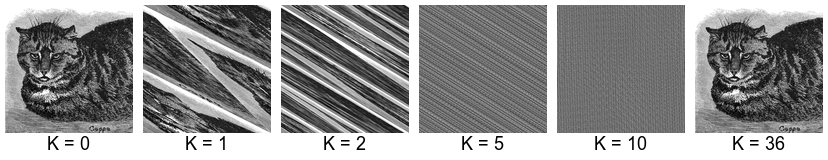

# CUDA - Arnold’s cat map


[Arnold's cat map](https://en.wikipedia.org/wiki/Arnold%27s_cat_map) is a continuous chaotic function that has been studied in the
'60s by the Russian mathematician [Vladimir Igorevich Arnold](https://en.wikipedia.org/wiki/Vladimir_Arnold).
In its discrete version, the function can be understood as a transformation of a bitmapped image $P$ of size $N \times N$ into a
new image $P'$ of the same size. For each $0 \leq x, y < N$, the pixel of coordinates $(x,y)$ in $P$ is mapped into a new position
$C(x, y) = (x', y')$ in $P'$ such that:

$$x' = (2x + y) \bmod N, \qquad y' = (x + y) \bmod N$$

(“mod” is the integer remainder operator, i.e., operator % of the C language). We may assume that $(0, 0)$ is top left and
$(N-1, N-1)$ is bottom right, so that the bitmap can be encoded as a regular two-dimensional C matrix.

The transformation corresponds to a linear “stretching” of the image, that is then broken down into triangles that are rearranged
as shown in Figure 1.



Arnold’s cat map has interesting properties. Let $C^k(x, y)$ be the $k$-th iterate of $C$, i.e.:

$$
C^k(x, y) =
\begin{cases}
(x, y) & \text{if } k = 0\\
C(C^{k - 1}(x,y)) & \text{if } k > 0
\end{cases}
$$

Therefore, $C^2(x,y) = C(C(x,y))$, $C^3(x,y) = C(C(C(x,y)))$, and so on.

If we apply $C$ once, we get a severely distorted version of the input.
If we apply $C$ again on the result, we get an even more distorted image.
As we keep applying $C$, the original image is no longer discernible.
However, after a certain number of iterations, that depends on the image size $N$ and has been proved to never exceed $3N$,
we get back the original image! (Figure 2).



The *minimum recurrence time* is the minimum number of iterations $k \geq 1$ such that produce the original image, i.e.,
$C^k(x, y) = (x, y)$ for all $(x, y)$.
In simple terms, the minimum recurrence time is the minimum number of iterations of the cat map that produce the starting image.

For example, the minimum recurrence time for [cat1368.pgm](input/cat1368.pgm)
of size $1368 \times 1368$ is $36$.
As said before, the minimum recurrence time depends on the image size $N$ only.
Unfortunately, no closed formula is known to compute the minimum recurrence time given $N$, although there are results and bounds
that apply to specific cases.

You are provided with a serial program that computes the $k$-th iterate of Arnold’s cat map on a square image.
The program reads the image from standard input in [PGM](https://en.wikipedia.org/wiki/Netpbm) (*Portable GrayMap*) format.
The results is printed to standard output in PGM format. For example:

```shell
./omp-cat-map 100 < cat1368.pgm > cat1368-100.pgm
```

applies the cat map $k=100$ times on *cat1368.pgm* and saves the result to *cat1368-100.pgm*.

To display a PGM image you might need to convert it to a different format, e.g., JPEG.
Under Linux you can use `convert` from the [ImageMagick](https://imagemagick.org/) package:

```shell
convert cat1368-100.pgm cat1368-100.jpeg
```

To make use of CUDA parallelism, define a 2D grid of 2D blocks that covers the input image.
The block size is $\mathit{BLKDIM} \times \mathit{BLKDIM}$, with `BLKDIM = 32`, and the grid size is:

$$(N + \mathit{BLKDIM} - 1) / \mathit{BLKDIM} \times (N + \mathit{BLKDIM} - 1) / \mathit{BLKDIM}$$

Each thread applies a single iteration of the cat map and copies one pixel from the input image to the correct position of the
output image. The kernel has the following signature:

```C
__global__ void cat_map_iter(unsigned char *cur, unsigned char *next, int N)
```

where $N$ is the height/width of the image. The program must work correctly even if $N$ is not an integer multiple of _BLKDIM_.
Each thread is mapped to the coordinates $(x, y)$ of a pixel using the usual formulas:

```C
const int x = threadIdx.x + blockIdx.x * blockDim.x;
const int y = threadIdx.y + blockIdx.y * blockDim.y;
```

Therefore, to compute the $k$-th iteration of the cat map we need to execute the kernel $k$ times.

A better approach is to define a kernel:

```C
__global__ void cat_map_iter_k(unsigned char *cur, unsigned char *next, int N, int k)
```

that applies $k$ iterations of the cat map to the current image.
This kernel needs to be executed only once, and this saves some significant overhead associated to kernel calls.
The new kernel can be defined as follows:

```C
const int x = ...;
const int y = ...;
int x_cur = x, y_cur = y, x_next, y_next;

if (x < N && y < N) {
	while (k--) {
		x_next = (2 * x_cur + y_cur) % N;
		y_next = (x_cur + y_cur) % N;
		x_cur = x_next;
		y_cur = y_next;
	}
	/* copy the pixel (x, y) from the current image to
	the position (x_next, y_next) of the new image */
}
```

I suggest to implement both solutions (the one where the kernel is executed $k$ times, and the one where the kernel is executed
only once) and measure the execution times to see the difference.

To compile:

```shell
nvcc cuda-cat-map.cu -o cuda-cat-map omp-cat-map
```

To execute:

```shell
./cuda-cat-map k < input_file > output_file
```

Example:

```shell
./cuda-cat-map 100 < cat1368.pgm > cat1368-100.pgm
```

## Files

- [cuda-cat-map.cu](base/cuda-cat-map.cu)
- [hpc.h](../../include/hpc.h)
- [cat1368.pgm](input/cat1368.pgm) (verify that the minimum recurrence time of this image is 36)
